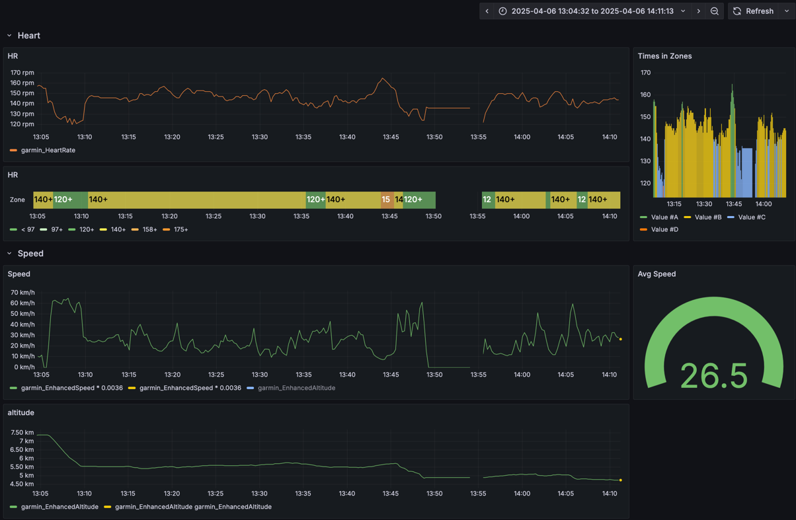

# fit-prometheus-exporter

A prometheus exporter for Garmin .fit files for people who want to
explore their training data from within grafana for some reason.

Tested metrics for cycling:

- HR
- Altitude
- Speed
- Cadence

## Usage

`go run main.go -f path/to/file.fit [-prometheus http://localhost:9090/api/v1/write]`

